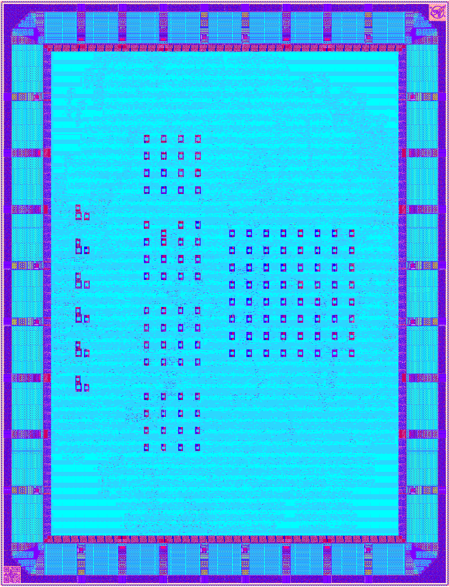

# Cloneless1
Cloneless1 is the first in a series of planned tamper-resistant cryptographic open-source silicon designs. It uses GlobalFoundries' 180nm open-source PDK [GF180MCU](https://gf180mcu-pdk.readthedocs.io/en/latest), the [wafer.space](https://wafer.space) [project template](https://github.com/wafer-space/gf180mcu-project-template) and has been submitted to the MPW shuttle [wafer.space GF180MCU Run 1](https://www.crowdsupply.com/wafer-space/gf180mcu-run-1) for fabrication. The Cloneless1 ASIC has been designed using the [librelane](https://librelane.readthedocs.io/en/latest) EDA tool flow and can be fully and easily reproduced from the sources and scripts provided in this repository.



## (Re-)Producing the Chip Design
After cloning the repository (```git clone https://github.com/ThorbenMoos/Cloneless1```) and performing a short environment setup, (re-)producing the entire chip design with all its intermediate stages and files should be as easy as a single call to the Makefile. To have that work, make sure to install [ghdl](https://github.com/ghdl/ghdl), [iverilog (Icarus Verilog)](https://github.com/steveicarus/iverilog), the make utility and the [nix](https://github.com/NixOS/nix) package manager. On Ubuntu Server 24.04 LTS the following commands have been tested for installing these utilities:

```
sudo snap install ghdl
sudo apt update
sudo apt install make
sudo apt install verilog
curl --proto '=https' --tlsv1.2 -sSf -L https://install.determinate.systems/nix | sh -s -- install --prefer-upstream-nix --no-confirm --extra-conf "
    extra-substituters = https://nix-cache.fossi-foundation.org
    extra-trusted-public-keys = nix-cache.fossi-foundation.org:3+K59iFwXqKsL7BNu6Guy0v+uTlwsxYQxjspXzqLYQs=
"
```

Once these steps are completed, a new terminal needs to be opened and ```nix-shell``` can be called in the main directory of this repository. Inside the shell simply call ```make``` and wait for the results (using a machine with at least 32 GB memory is recommended). The Makefile verifies testbenches, converts the sources, clones the PDK and executes the librelane flow, first to pre-harden some macros and then to implement the overall chip design. With the provided configuration, the overall runtime will be more than 8 hours on most machines. The GDS is usually ready after 3-4 hours (after fill insertion), the remaining time is for sign-off steps. If everything goes well the design should pass all Antenna, DRC and LVS checks and the produced GDS should have the following hashes:

md5sum: 0545febbda0f2e6065ca045db22bff07  
shasum: 6e4dae35adf046a774b3f1f03f6dcd72c6e71f5a  
sha256sum: 0894d1cf54045aa2bb673c368a5e4bb5716523ebdd55ada8d1f61ecbb73f4b3f

## RTL Design
The RTL design is fully written in VHDL, all sources are located in the ```src``` folder. Many high-level modules make use of generics to keep the designs parametrizable and useful beyond their concrete instantiation in this project. Conversion from VHDL to Verilog for compatibility with the EDA tool is performed with ghdl.

## Science and Cryptography
The Cloneless1 design implements and/or leverages the following scientific results and cryptographic primitives:

- The mid-pSquare block cipher [1] which is an instance of the Feistel for Prime Masking (FPM) family of tweakable block ciphers [2].
- Inner-product masking over a Mersenne prime field, combining results of [3], [4] and [5] for both side-channel and fault resistance.
- Duplication with redundant error checks for fault resistance.
- The Edge-Sampling based True Random Number Generator (ES-TRNG) [6] for seed generation.
- The Trivium stream cipher [7] for concurrent pseudo-randomness generation from the initial seed as recommended in [8].
- A Ring-Oscillator based Physically Unclonable Function (RO-PUF) first introduced in [9] to generate private key material.

The mid-pSquare cipher implementation uses two shares and two redundancy domains. Raw outputs of some exemplary TRNG and PUF designs with different parametrization are accessible via the framework. Error-corrected TRNG and PUF outputs used for key and randomness generation of the block cipher are not accessible via the interface.

[1]: https://doi.org/10.46586/tches.v2025.i4.486-519, https://github.com/uclcrypto/mid-pSquare  
[2]: https://doi.org/10.1007/978-3-031-58734-4_7, https://github.com/uclcrypto/small-pSquare  
[3]: https://doi.org/10.1007/978-3-031-30634-1_20  
[4]: https://doi.org/10.46586/tches.v2024.i4.690-736  
[5]: https://doi.org/10.1007/978-981-95-5096-8_17  
[6]: https://doi.org/10.13154/tches.v2018.i3.267-292  
[7]: https://doi.org/10.1007/11836810_13  
[8]: https://doi.org/10.62056/akdkp2fgx, https://github.com/uclcrypto/randomness_for_hardware_masking  
[9]: https://doi.org/10.1145/1278480.1278484

## Functionality and Purpose
The Cloneless1 chip encrypts plaintexts with the mid-pSquare block cipher and outputs the respective ciphertexts. It is designed to do so without revealing intermediate computation results to physical adversaries. The primary cryptographic key that can be used is hardcoded in shared form and identical for all samples of the chip. The secondary cryptographic key that can be selected via the configuration registers derives some entropy from error-corrected RO-PUF responses and should be different between any two chip samples (the level of stability is yet to be tested). The purpose of the design is to provide an open and verifiable testing target for all kinds of physical attacks. In particular, it is designed to empirically evaluate the effectiveness of the employed combination of protection mechanisms. Furthermore, the raw PUF and TRNG responses that are accessible via the toplevel interface are meant for characterization of oscillator behavior in the technology to determine proper parametrization for future iterations in the Cloneless series. Finally, the design is meant to experimentally evaluate whether the combination of leakage-resilient secret sharing and tamper-evident delay-based PUFs can become a viable protection against invasive physical adversaries.

## Disclaimer
This is our first attempt at building a tamper-resistant cryptographic ASIC using fully open-source EDA tools and PDKs only. While the cryptography, science and high-level design principles should be sound (see the referenced peer-reviewed articles), it is possible, even likely, that the low-level implementation contains flaws that will affect the functionality and/or intended security properties. The plan is to discover such mistakes, report them and learn from them in the open, instead of behind closed doors as typically done in cryptographic IC design. As is, the design is not concretely useful beyond research purposes, as the chip aims at experimental verification of the physical security properties instead of providing full end-to-end security. The design and documentation target research-level quality and [TRL](https://en.wikipedia.org/wiki/Technology_readiness_level) 3.

## Citing
To reference the current release in academic publications you may use the following DOI link. It can be used to generate citations in common formats.

[](https://doi.org/10.5281/zenodo.18184084)